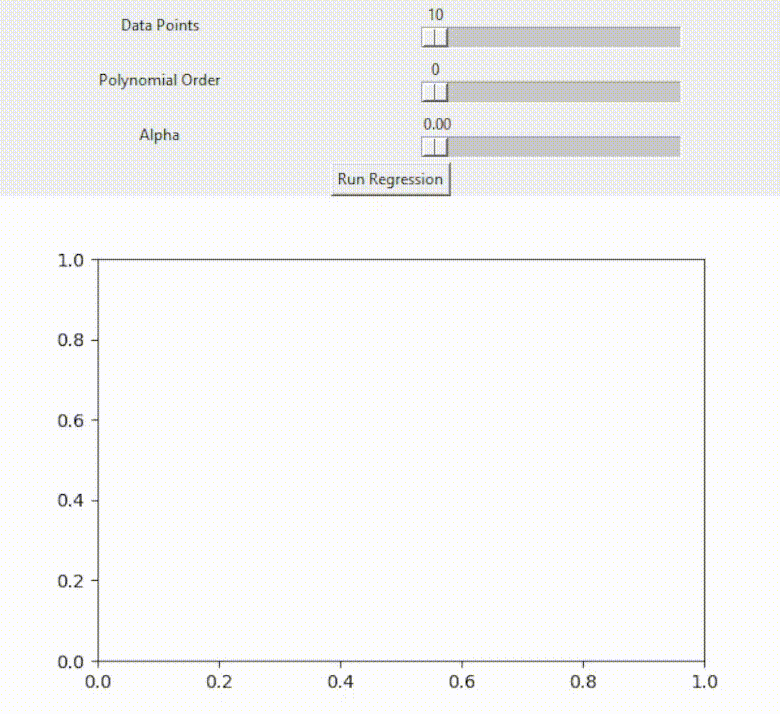

# Polynomial-Model-Fit

### About
This GitHub repository is dedicated to exploring how polynomial regression models fit a synthetic dataset generated from a sine function with added noise. To assess the model's performance in diverse scenarios, we manipulate three key parameters:
* Number of samples used to train model
* Model complexity
* Regularization

  

### Prerequisites

To set up and use this code, ensure that you have the required dependencies installed. You can easily install them by running the following command:
pip install -r requirements.txt

### Usage
* Open the code file and configure the following parameters to experiment with different conditions:

  -DATAPOINTS: The number of samples used to train the model.
  
  -POLYNOMIAL_DEGREE: The complexity of the polynomial function.
  
  -ALPHA: The regularization parameter.
  
  Run the code to perform the polynomial regression experiment and visualize the results.

(<a href="#readme-top">back to top</a>)

